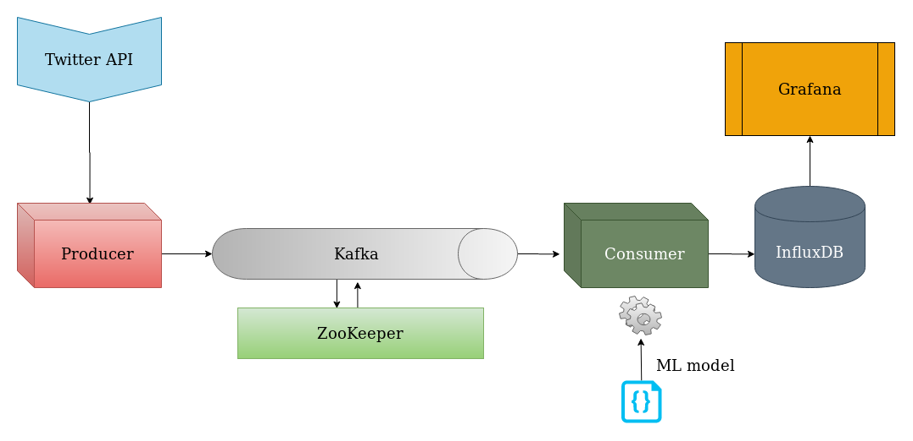

# Tales of Twitter
What if we could see the sentiments of people through the breadcrumbs they leave on Twitter ?

## Quick Access Links

This project is described in details in [this article](https://medium.com/@redouane.achouri/twitter-sentiment-analysis-a-tale-of-stream-processing-8fd92e19a6e6).

Final dashboard can be found here: [grafana.redouaneachouri.com](http://grafana.redouaneachouri.com/d/_TYUeQCZk/twitter-sentiment-analysis).

The Modelization part is described at [./model/twitter-sentiment-analysis.ipynb](./model/twitter-sentiment-analysis.ipynb).




## Deployment

Local deployment is done through this [docker-compose.yaml](docker-compose.yaml) file.

Live deployment instructions will be published in a separate tutorial/instructions which will consist mainly of how to setup SSL Encryption with a reverse NGINX proxy to enable Let's Encrypt. Following tutorials will be helpful if you want to setup your own encryption machinery: [Nginx Proxy](https://github.com/nginx-proxy/nginx-proxy) and [Let's Encrypt](https://github.com/nginx-proxy/docker-letsencrypt-nginx-proxy-companion).

Compose offers a way to control the order of statup and shutdown of containers through the `depends_on` option, but, by design, [there is no way to delay statup until a service becomes available](https://docs.docker.com/compose/startup-order/) - unless we run a script that waits for a service to become available with a `command` option.

> The problem of waiting for a database (for example) to be ready is really just a subset of a much larger problem of distributed systems. In production, your database could become unavailable or move hosts at any time. Your application needs to be resilient to these types of failures.

> To handle this, design your application to attempt to re-establish a connection to the database after a failure. If the application retries the connection, it can eventually connect to the database.

### Requirements

- After obtaining your set of Twitter API key and secret (See article mentioned above), you have to set those in the (secret.ini)[./produce-tweets/secret.ini] file.

- Run the Jupter Notebook (twitter-sentiment-analysis.ipynb)[./model/twitter-sentiment-analysis.ipynb] to build a model and save it in a *.pickle* file. See the (README.md)[./model/README.md] file for running instructions.

### Starting the Services

Services need to be started in a specific order with the following commands:
```
# Start Kafka and InfluxDB
docker-compose up -d kafka influxdb

# Start Grafana
docker-compose up -d grafana

# Start the producer and the consumer
docker-compose up -d producer consumer
```

### Useful Links
- [Twitter Developers portal](https://developer.twitter.com/en/docs)
- [Sentiment Analysis with Python NLTK](https://www.digitalocean.com/community/tutorials/how-to-perform-sentiment-analysis-in-python-3-using-the-natural-language-toolkit-nltk)
- [Kafka Quickstart](https://kafka.apache.org/quickstart)
- [A Practical Introduction to Kafka Storage Internals](https://medium.com/@durgaswaroop/a-practical-introduction-to-kafka-storage-internals-d5b544f6925f)
- [Deploy a Kafka broker in a Docker container](https://www.kaaproject.org/kafka-docker)
