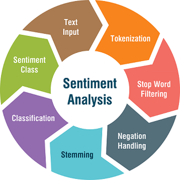

# Tales of Twitter
What if we could see the emotions and moods of people through the breadcrumbs they leave on Twitter ?

## Architecture Summary
This project is be based on micro-services each of which is wrapped into a docker container.

# Steps

Text input > Tokenization > Stop-words filtering > Negation handeling > Stemming > Classification > Sentiment class - Source: [Medium](https://medium.com/@tomyuz/a-sentiment-analysis-approach-to-predicting-stock-returns-d5ca8b75a42)

## Fetch and queue the tweets
## Build a Sentiment Analysis model
## Pipe the tweets through the model
## Play with results :)

# Useful Links
- [Using Twurl](https://developer.twitter.com/en/docs/tutorials/using-twurl)
- [Kafka Quickstart](https://kafka.apache.org/quickstart)
- [A Practical Introduction to Kafka Storage Internals](https://medium.com/@durgaswaroop/a-practical-introduction-to-kafka-storage-internals-d5b544f6925f)
- [Deploy a Kafka broker in a Docker container](https://www.kaaproject.org/kafka-docker)
